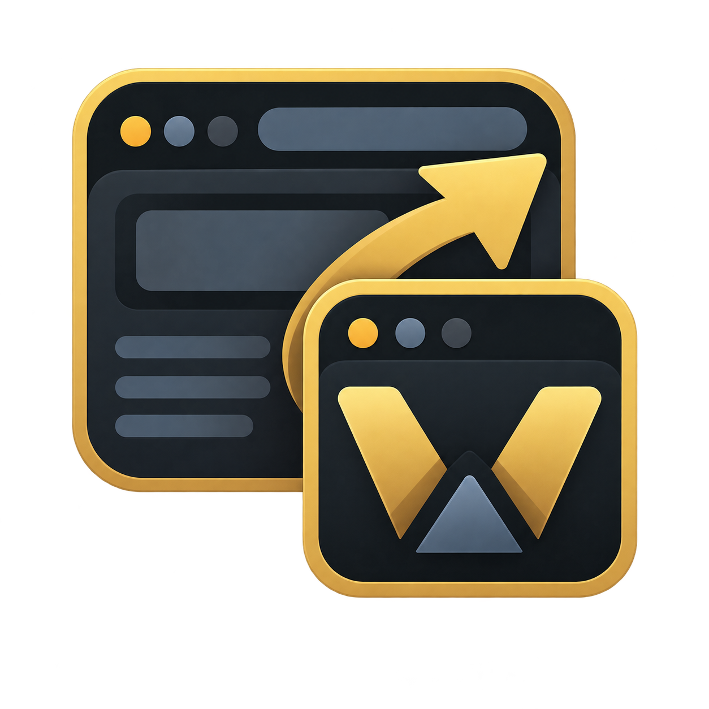

# Arcane Webb Apps

<p align="center">
  
</p>

Turn any website into a focused desktop app.

Arcane Webb Apps is a tiny, local-first launcher inspired by the simplicity of
[Omarchy](https://omarchy.org/). Add a URL, give it a name, and open it in a clean,
frameless native window. Assign an optional global keyboard shortcut to keep the
websites you use every day one keystroke away.

## Features

- Add any HTTP or HTTPS website
- Launch sites in separate frameless windows
- Reposition frameless windows from a small fixed overlay handle
- Assign optional system-wide keyboard shortcuts
- Lives quietly in the macOS menu bar or Windows/Linux system tray
- Focus an existing app window instead of opening duplicates
- Store your app list and preferences locally
- No account, telemetry, or cloud service
- Lightweight Tauri 2 application using the operating system's native webview

Because web-app windows have no title bar, close them with `⌘W` on macOS or
`Ctrl+W` on Windows and Linux. Webb Apps explains this before launching and lets
you permanently dismiss the reminder.

> [!NOTE]
> Some websites prevent sign-in or other functionality inside embedded webviews.
> This is controlled by the website and cannot always be worked around by Webb Apps.

## Install

Download the installer for your platform from
[GitHub Releases](https://github.com/DevelDoe/arcane_webb_apps/releases).

macOS builds are currently unsigned. After extracting the app, control-click it and
choose **Open** the first time if Gatekeeper blocks a normal double-click.

The project is young, so packages may initially be available for only the platforms
on which maintainers can build and test them. You can always build from source.

## Use

1. Select **Add web app**.
2. Enter a name and website URL.
3. Optionally enter a shortcut such as `CommandOrControl+Shift+L`.
4. Select the app card—or use its shortcut—to launch it.

Global shortcuts work while Arcane Webb Apps is running. Common shortcut names
include `CommandOrControl`, `Shift`, `Alt`, and function keys such as `F8`.
Closing the launcher hides it to the tray so those shortcuts remain available. Use
the tray menu's **Quit Webb Apps** action when you want to stop it completely.

## Build from source

Requirements:

- [Rust](https://www.rust-lang.org/tools/install)
- [Node.js](https://nodejs.org/) 20 or newer
- The [Tauri prerequisites](https://v2.tauri.app/start/prerequisites/) for your OS
- Tauri CLI 2: `cargo install tauri-cli --version '^2' --locked`

```sh
git clone git@github.com:DevelDoe/arcane_webb_apps.git
cd arcane_webb_apps/frontend
npm install

cd ../backend
cargo tauri dev
```

Run the checks directly with:

```sh
cd frontend
npm run typecheck
npm run build

cd ../backend
cargo check
```

## Release without GitHub Actions

Releases are built locally to avoid spending GitHub Actions minutes on Tauri builds.
Install and authenticate the [GitHub CLI](https://cli.github.com/), make sure the
version in `backend/tauri.conf.json` matches, then run:

```sh
./scripts/release.sh 0.1.0
```

The script verifies the project, builds the native bundle on your current operating
system, creates tag `v0.1.0`, and uploads the resulting package to GitHub Releases.
Run it on each desired operating system with the same version; subsequent runs add
that platform's installers to the existing release.

## Privacy and security

Saved URLs, shortcuts, and preferences remain in Tauri's local application store.
Websites still communicate with their own servers exactly as they would in a browser.
Only add websites you trust.

## License

[MIT](LICENSE)
